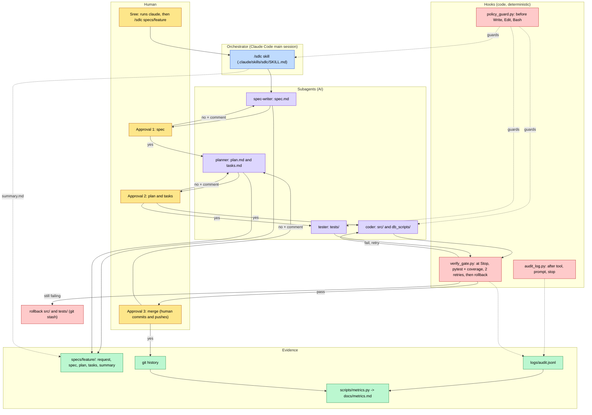
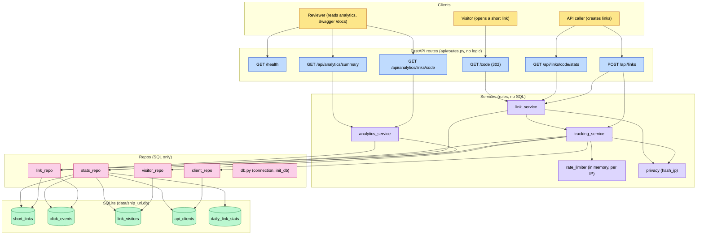
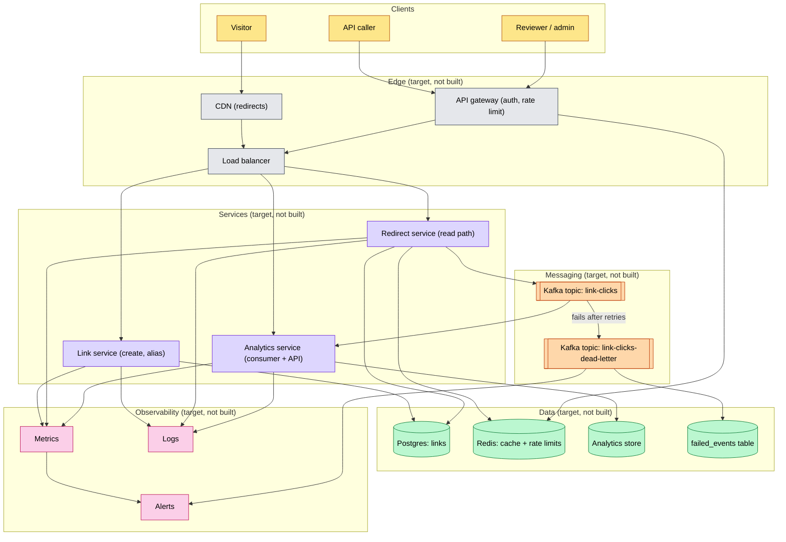

# snip-url: Architecture

Author: Sree | Date: 2026-10-08 | Status: Draft for review

## 1. Overview

- snip-url is two things: a small URL shortener (FastAPI + SQLite) and the agentic SDLC workflow that built it.
- The app creates short links (random or custom alias), redirects with 302, records every click, and serves per-link and summary analytics. Rate limiting applies to link creation. IP addresses are stored hashed only.
- The workflow is Claude Code only: one skill (`/sdlc`), four subagents (`spec-writer`, `planner`, `coder`, `tester`), three hooks (`policy_guard`, `audit_log`, `verify_gate`). There is no custom orchestrator program.
- Three human approvals (spec, plan, merge) gate the work; the human commits and pushes.
- The app is fully deterministic. AI is used only in the development workflow. Diagrams 1 and 2 show what is built; diagram 3 is a target design that is **not built**.

## 2. Diagram 1: Agentic SDLC workflow (built)

| Component | Role |
|---|---|
| `/sdlc` skill | Runs the steps in order: SPEC, PLAN, BUILD, VERIFY, DOCS, MERGE, SUMMARY. Stops at each approval. Writes only `README.md` and `summary.md`. |
| `spec-writer` | Writes `spec.md` from `request.md`; asks questions when the request is vague. |
| `planner` | Writes `plan.md` (impact analysis and file/function contract) and `tasks.md` (owner, dependencies, [P]). |
| `coder` | Implements coder tasks in `src/snip_url/` and `db_scripts/`. |
| `tester` | Writes pytest tests in `tests/`. Runs in parallel with `coder`, bound by the plan.md contract. |
| `policy_guard.py` | PreToolUse on Write, Edit, MultiEdit, NotebookEdit, Bash. Exit code 2 blocks: locked files (`.claude/hooks/`, `.github/`, `settings.json`, `constitution.md`), secret-like text, `.env` access. |
| `audit_log.py` | PostToolUse, UserPromptSubmit and Stop. Appends one JSON line per event to `logs/audit.jsonl`; never blocks. |
| `verify_gate.py` | Stop hook. Runs pytest and coverage when `src/` or `tests/` changed. Blocks twice (max 2 retries), then rolls back. |
| `settings.json` | Deny rules: read of `.env` and `.env.*`, `git push`, `git add -A`, `git add .`. |
| `scripts/metrics.py` | Reads the audit log and git: runs, success rate, retries, rollbacks, MTTR, latency. |

**Deterministic vs AI boundary.** AI (non-deterministic): writing specs, plans, code and tests. Code (deterministic): hooks, deny rules, pytest, coverage, rollback, metrics. Step order is followed by the AI from the skill and is not forced by code (a known trade-off, V8 in the review checklist); the checks that matter are enforced by hooks.

## 3. Diagram 2: Current application (built)

| Component | Role |
|---|---|
| `main.py` | `create_app()`: settings, rate limiter, error handlers, router; lifespan runs `init_db` at startup only. |
| `api/routes.py` | Six routes (health, create, stats, redirect, two analytics). No business logic. Uses the direct client IP, ignores `X-Forwarded-For`. |
| `common/errors.py` | `AppError` and one JSON error format `{"error": {...}}`; handlers for app errors and validation errors. |
| `services/link_service.py` | URL and alias validation, random 7-char code, create, `resolve_and_record_click`, `get_stats`. |
| `services/rate_limiter.py` | `RateLimiter`: in-memory sliding window per IP (create only). |
| `services/tracking_service.py` | Click recording, link-created counts, client lookup, `enforce_create_limit` (records rate-limit hits). |
| `services/analytics_service.py` | Per-link daily series and summary over a `days` window (1-90). |
| `services/privacy.py` | `hash_ip(ip, salt)`: raw IPs are never stored. |
| `repo/*_repo.py`, `repo/db.py` | All SQL. `db.py` holds the real schema, connection, commit/rollback, and `init_db` (renames old tables, adds missing columns). |
| SQLite tables | `short_links`, `click_events`, `link_visitors`, `api_clients`, `daily_link_stats` (see `db_scripts/schema.sql`, reference only). |
| `db_scripts/seed_data.py` | Re-runnable seed: 30+ links with clicks over 14+ days. |

**Deterministic vs AI boundary.** Everything in this diagram is deterministic code. A click and its counters are written in one transaction. No AI call happens at runtime.

## 4. Diagram 3: Target design (NOT built)

> **Target design, not built.** This is how snip-url could scale. Nothing in this diagram exists in the repository. It follows the reference article in section 6 and the NFR list in `docs/review-checklist.md` section E.

| Component | Role (target, not built) |
|---|---|
| CDN | Serves redirects close to the visitor. |
| Load balancer + API gateway | Horizontal scaling; auth (API key/OAuth) for create and analytics; redirects stay public; trusted proxy IP for rate limits. |
| Link service | Create links and aliases. Owns link data in Postgres. |
| Redirect service | Read path: Redis cache-aside lookup, Postgres on miss, publishes a click event. Does not wait for analytics. |
| Analytics service | Consumes `link-clicks`, writes the analytics store, serves analytics API. Reads events, not shared tables. |
| Kafka `link-clicks` and dead-letter topic | Click events are written asynchronously; failed events go to the dead-letter topic. |
| Postgres / Redis / analytics store / `failed_events` | Links; cache and shared rate-limit counters; click analytics; failed events kept for retry and analysis. |
| Metrics, logs, alerts | Request metrics, error rate, latency percentiles, alerts on dead-letter growth. |

**Deterministic vs AI boundary.** Same as today: the whole runtime is deterministic. AI stays in the development workflow only.

## 5. Built vs target at a glance

| Aspect | Built | Target (not built) |
|---|---|---|
| Access path | HTTP API, Swagger `/docs` | CDN, load balancer, API gateway |
| Services | One process: routes -> services -> repos | Link, redirect and analytics services |
| Click recording | Synchronous, one transaction | Asynchronous via Kafka |
| Data | SQLite, 5 tables | Postgres, Redis, analytics store |
| Rate limiting | In memory, per direct IP, create only | Redis shared counter, trusted proxy IP |
| Failed events | Not stored | Dead-letter topic + `failed_events` |
| Auth | None | API key/OAuth for create and analytics |
| Monitoring | Agent workflow: audit log + `metrics.py`; app: uvicorn access log | Metrics, logs, alerts |

## 6. Comparison with the reference design

Reference article: "System Design | Design a URL Shortener (Tiny URL)", LeetCode Discuss, by Aryan Sharma: https://leetcode.com/discuss/post/6149386/system-design-design-a-url-shortener-tin-80zk/

| Reference article | snip-url | Why |
|---|---|---|
| Load balancer + API gateway + stateless web servers | Adopt in target design | Standard horizontal scaling |
| Redis cache-aside for hot links | Adopt in target design | Low-latency redirects |
| NFRs: low latency, high availability, fault tolerance, scalability | Adopt as NFR list | Same goals |
| 301 permanent redirect | Differ: 302 | 301 is cached by browsers, so repeat clicks are lost (this is BUG-01) |
| MongoDB (NoSQL) | Differ: SQL (prototype); key-value for redirects in target | Prototype needs transactions and simple setup |
| PUT update of destination URL | Differ: not offered | A changeable destination is a phishing risk |
| No rate limiting, no analytics design | Add: rate limiting, Kafka click events, analytics service, hashed IPs | Schwab asks for analytics and reliability |
