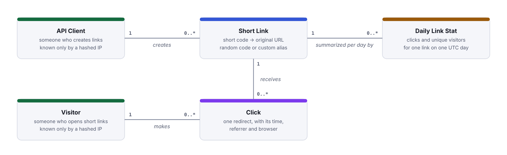
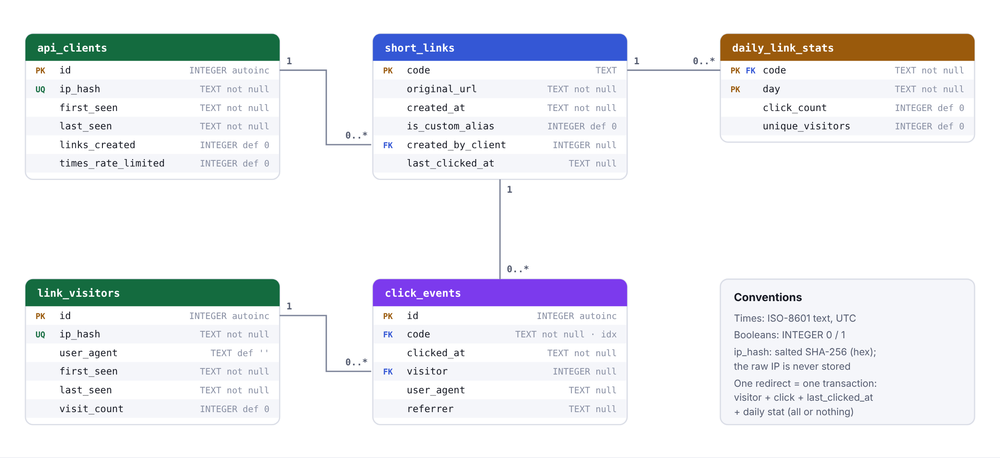

# snip-url: Design

Author: Sree | Date: 2026-10-08 | Status: Draft for review

This document describes the application as built (FastAPI + SQLite, 81 tests) and, where stated, the target design that is **not built**. Diagrams are in [architecture.md](architecture.md); decisions and their reasons are in [decisions.md](decisions.md); the reviewer map for Schwab is [SCHWAB_SPEC_MAPPER.md](SCHWAB_SPEC_MAPPER.md).

Contents: 1 Constraints, assumptions and trade-offs · 2 Back-of-envelope estimates · 3 API · 4 Data model · 5 Key flows · 6 Non-functional requirements · 7 Known limitations

## 1. Constraints, assumptions and trade-offs

This section summarizes the approved brief ([project_brief.md](project_brief.md)) and the one spec that left the load question open ([specs/003-viral-traffic/spec.md](../specs/003-viral-traffic/spec.md)). The brief is not repeated in full; follow the links for the original text.

### 1.1 Constraints ([brief section 1](project_brief.md#1-problem-fde-framing))

- What is graded is the controlled agentic workflow, not the shortener. The app is the example product.
- 2-3 days, one person, own API budget, Windows laptop, and the result must be explainable live in the interview.
- Out of scope for the build ([brief section 10](project_brief.md#10-out-of-scope-listed-in-readme-as-future-work)): login and JWT, link expiry, list or delete links, background click queue, Redis cache, Postgres, Docker, cloud deployment, load testing. These appear only in the target design (section 6).

### 1.2 Trade-offs ([brief section 2b](project_brief.md#2b-key-trade-offs))

| Decision | Chosen | Given up |
|---|---|---|
| Orchestrator | Claude Code skill + subagents + hooks | Step order is followed by the AI, not forced by code |
| Gates | Hooks (code) | Hooks are Claude Code specific |
| Parallel build | coder and tester at the same time | Needs a strict contract in plan.md |
| Rollback | git stash of `src/` and `tests/` | Only code is rolled back, not spec files |
| Database | SQLite | Not for production scale |
| Short code | Random 7-char base62 | Small collision chance (checked on insert) |
| Redirect | 302 | Slightly more server load; every click is counted |
| Runs | Live only | Results vary run to run; cost per run |

Reasons and the S2-S4 decisions are in [decisions.md](decisions.md).

### 1.3 Assumptions ([brief section 8](project_brief.md#8-assumptions))

- Python 3.12, FastAPI, SQLite, pytest; Windows laptop with Claude Code.
- Live agent runs only (no replay); cost per scenario is recorded in `summary.md`.
- One human approver (Sree).

### 1.4 Risks ([brief section 9](project_brief.md#9-risks-and-mitigations-fde-decided-before-building))

The brief lists ten risks with mitigations decided before building. The ones that shape this design:

- **Over-engineering:** build only the brief; ideas go to Limitations, not code. This is why caching, queues and Postgres are target design only.
- **Step order followed by the AI:** hooks enforce tests, writes and logging in code; the order itself is a stated trade-off (V8, section 7).
- **Coder and tester mismatch:** the planner writes an exact file/function contract in `plan.md`.
- **Secrets:** `.env` is denied in `settings.json` and blocked by `policy_guard`.
- **Repeated test failures:** 2 retries, then rollback; the human decides.

### 1.5 Viral traffic: the load question is open ([spec 003](../specs/003-viral-traffic/spec.md))

Scenario S3 asked "make it handle viral traffic". The business has no target, so the run **stopped at the approved spec** and nothing was built.

- **Decided by the human:** stay inside the brief (no queue, cache or new infrastructure); keep the create rate limit (10 per 60 s); no rate limit on redirects; nothing built, load verification is a future step.
- **Assumptions (recommended defaults, owned by the business):** A1 the surge is on redirects; A2 about 100 redirects per second on one link, single server (a placeholder); A3 "handle" = no 5xx and no lost clicks, no latency number; A4 above the target redirects are never blocked, slowdown is acceptable; A5 click counts stay exact.
- **Five open questions** (scope, target load, meaning of "handle", behavior above target, click accuracy) wait for the business. The estimates in section 2 are my inputs to that conversation, not answers to it.
- **Spec criteria:** only non-regression (existing tests pass, 302 plus one click, 429 with `Retry-After`, coverage at least 80%).

## 2. Back-of-envelope estimates

**Every input below is an assumption to be confirmed by the business** (it belongs with the S3 open questions Q1-Q5 in [spec 003](../specs/003-viral-traffic/spec.md)). None is measured; none is built into the app. They size the target design only.

### 2.1 Inputs (assumptions)

| # | Input | Value | Confirm with the business (S3) |
|---|---|---|---|
| I1 | New links per day | 100,000 | Q2 target load |
| I2 | Read:write ratio | 100:1 (100 redirects per link created) | Q1 scope: which operation |
| I3 | Peak vs average | peak = 10x average | Q2, Q4 |
| I4 | Size of a link row | about 500 bytes | technical, from the schema plus indexes |
| I5 | Size of a click event | about 200 bytes | Q5 click accuracy decides if raw events are needed |
| I6 | Retention | links 5 years; raw clicks 1 year | business and privacy |
| I7 | Cache rule | hottest 20% of a day's links cached | technical |

### 2.2 Working

**Traffic**

- Redirects per day = 100,000 links x 100 = **10,000,000**.
- Average redirects per second = 10,000,000 / 86,400 s = **about 116/s**.
- Peak redirects per second = 10 x 116 = **about 1,160/s** (call it 1,200/s).
- Link creates: 100,000 / 86,400 = about 1.2/s average, about 12/s peak. Small next to reads.

**Link storage (5 years)**

- Links in 5 years = 100,000 x 365 x 5 = **182,500,000**.
- Storage = 182.5 million x 500 B = 91.25 GB, **about 91 GB** (about 18 GB per year).

**Click storage (raw events)**

- Per day = 10,000,000 x 200 B = 2,000,000,000 B = **2 GB/day**.
- Per year = 2 GB x 365 = **730 GB**. Raw clicks are kept 1 year, so about 730 GB is the steady-state size.
- Links plus raw clicks together: about 821 GB. Clicks dominate storage by about 8 to 1.
- Daily aggregates (like `daily_link_stats`) are tiny by comparison and can be kept longer; that choice is for the business.

**Cache size (hottest 20% of a day's links)**

- "A day's links" here means the 100,000 links created that day (I1). 20% of them = 20,000 links.
- Cache = 20,000 x 500 B = 10,000,000 B = **about 10 MB**. Even with generous overhead this fits in one small Redis instance.
- Sensitivity: if old links are read too, and the hottest 20% of **all** 182.5 million links were cached, that is 36.5 million x 500 B = about 18 GB, still one large Redis node. The real number of distinct links read per day is not known; it is an input to ask the business for.

**How many codes 7 base62 characters allow**

- 62 characters (a-z, A-Z, 0-9), 7 positions: 62^7 = **3,521,614,606,208, about 3.5 trillion**.
- After 5 years, 182.5 million codes are used: 182.5e6 / 3.52e12 = 0.0052%, or about 1 in 19,300.
- **The 1 in 19,300 is a per-link chance at one point in time.** At the end of year 5, one newly generated random code has about a 1 in 19,300 chance of matching a code that already exists. Earlier it is lower, because fewer codes are used.
- **Over the whole 5 years the total is larger.** About 182.5 million links are created, and the chance per link grows from 0 to 1 in 19,300. Adding it up gives about n^2 / (2 x 3.52e12) = (1.825e8)^2 / 7.04e12, roughly **4,700 collisions in total, a few thousand**. That is about 0.0026% of new links, or 1 in 38,600 on average. Rare per link, not zero in total.
- **So the app must handle collisions, and it does.** It checks each new code on insert and generates a new one if it is taken (next bullet). The random code also cannot be guessed from a counter.
- The current code checks for the code before inserting and tries up to 10 times (`make_unique_code`). Ten collisions in a row would have probability about (5.2e-5)^10, roughly 1e-43, so a `500 code_generation_failed` is practically unreachable. The `short_links.code` primary key is the real guarantee that no two links share a code. The retry covers the check, not the insert: `create_random_link` uses a plain insert, so two simultaneous requests that pick the same new code could make the second insert fail with an unhandled database error. With one SQLite process this is very unlikely; the target design must retry on a duplicate-key error (see section 7).
- Custom aliases (3-30 characters) share the same keyspace. An alias equal to an existing code is `409 alias_taken`.

### 2.3 What this means for the design

1. **Reads dominate (100:1), and the same few links get most of the reads.** A cache of about 10 MB (Redis, cache-aside) can answer most redirects without touching the database. That is why the target design adds a Redis cache in front of the redirect lookup.
2. **A redirect is a database write today.** The prototype saves a click event, a visitor update, `last_clicked_at` and a daily stat in one transaction (decision D-14). At about 1,200 redirects per second that is 1,200 write transactions per second. SQLite allows one writer at a time, and even Postgres would carry that write load on the redirect path for no benefit to the user. The user needs only the 302.
3. **Click data is large and grows without bound.** 2 GB/day and 730 GB/year of raw events is a different workload from 91 GB of link rows: append-only, written constantly, read in aggregates. So the target design moves click recording off the redirect path: the redirect service publishes a `link-clicks` event to Kafka and returns the 302; the analytics service consumes the events and writes the analytics store. Failed events go to a dead-letter topic and a `failed_events` table instead of being lost or blocking the redirect.
4. **Short codes need no special scheme.** 3.5 trillion codes against 182.5 million links means random codes with a uniqueness check are enough; no counter service or range allocator is needed.
5. **Cost of the move.** Click counts become eventually consistent (seconds behind) unless the business needs exact real-time counts. This is exactly open question Q5 in spec 003 and must be answered before building.

## 3. API

Built with FastAPI. All paths are served at the app root (default `http://localhost:8000`). Interactive docs: `/docs` (limitations in V10, section 7).

### 3.1 JSON error format

Every error raised by the app has the same body:

```json
{"error": {"code": "link_not_found", "message": "Short code not found"}}
```

| Status | `error.code` | When |
|---|---|---|
| 404 | `link_not_found` | Unknown code (redirect, stats, link analytics) |
| 409 | `alias_taken` | Alias already used, including by a random code |
| 422 | `invalid_url` | URL missing or blank, over 2048 characters, scheme not http/https, or no host |
| 422 | `invalid_alias` | Alias not 3 to 30 characters of letters, digits and `-` |
| 422 | `reserved_alias` | Alias is `api`, `health`, `docs` or `openapi` (any case) |
| 422 | `invalid_request` | Body or query parameter fails validation (wrong type, bad JSON, `days` outside 1 to 90). The message is always "Request body is invalid" (V11) |
| 429 | `rate_limited` | More than 10 create requests in 60 s from one IP. Header `Retry-After: <seconds>` |
| 500 | `code_generation_failed` | 10 random codes in a row already existed (practically unreachable) |

Paths that match no route, and methods that are not allowed, return FastAPI's default `{"detail": "..."}` body, not the format above (V10).

### 3.2 Endpoints

**GET /health**

- Response `200`: `{"status": "ok"}`.

**POST /api/links** - create a short link

- Request body (JSON): `url` (string, required), `alias` (string, optional).
- Response `201`: `{"code": "aB3xY9Z", "short_url": "http://localhost:8000/aB3xY9Z", "original_url": "https://www.schwab.com", "created_at": "2026-10-08T10:00:00.000000+00:00"}`.
- Without `alias` the code is 7 random base62 characters. With `alias` the code is the alias (case-sensitive).
- Errors: 422 `invalid_url` / `invalid_alias` / `reserved_alias` / `invalid_request`; 409 `alias_taken`; 429 `rate_limited`; 500 `code_generation_failed`.
- Rate limit: 10 requests per 60 s per direct client IP, sliding window, in memory. Every attempt counts, including invalid ones. `X-Forwarded-For` is ignored. The 11th request returns 429 with `Retry-After`.

**GET /{code}** - redirect

- Response `302` with `Location: <original URL>`. One click is recorded (flow 5.2).
- Errors: 404 `link_not_found`.
- Not rate limited. 302 (not 301) so browsers do not cache the redirect and every click reaches the server.

**GET /api/links/{code}/stats** - click count for one link

- Response `200`: `{"code": "...", "original_url": "...", "created_at": "...", "click_count": 2}`.
- Errors: 404 `link_not_found`.

**GET /api/analytics/links/{code}?days=N** - per-day analytics for one link

- Query: `days` integer, default 7, from 1 to 90.
- Response `200`: `{"code": "...", "days": 7, "daily": [{"day": "2026-10-02", "clicks": 3, "unique_visitors": 2}, ...], "total_clicks": 12, "total_unique_visitors": 7}`. `daily` has exactly N entries (UTC days, oldest first, ending today; days without clicks show 0). `total_unique_visitors` counts distinct visitors over the whole window, so it can be lower than the sum of the daily values.
- Errors: 404 `link_not_found`; 422 `invalid_request` for a bad `days`.

**GET /api/analytics/summary?days=N** - top links and totals

- Query: `days` as above.
- Response `200`: `{"days": 7, "top_links": [{"code": "...", "original_url": "...", "clicks": 25}, ...], "total_links": 30, "total_clicks": 300, "total_visitors": 40, "total_api_clients": 5}`. `top_links` has at most 10 entries, ordered by clicks (ties by code). All totals are for the last N days: links created, click events, distinct visitors with a click, and API clients last seen in the window.
- Errors: 422 `invalid_request` for a bad `days`.

Also served by FastAPI: `/docs` (Swagger UI), `/redoc`, `/openapi.json`.

## 4. Data model

SQLite. The app creates the tables at startup (`init_db` in `src/snip_url/repo/db.py`, called from the FastAPI lifespan, so importing the app creates no database). `db_scripts/schema.sql` is a reference copy; the app does not read it. All timestamps are ISO 8601 UTC text; booleans are INTEGER 0/1. Foreign keys are on (`PRAGMA foreign_keys = ON`). A diagram of the tables is in [data-model.html](data-model.html).





### 4.1 Tables

**short_links** - one row per short link

| Column | Type | Notes |
|---|---|---|
| `code` | TEXT | **Primary key.** Random 7 characters or the custom alias |
| `original_url` | TEXT NOT NULL | |
| `created_at` | TEXT NOT NULL | |
| `is_custom_alias` | INTEGER NOT NULL, default 0 | 1 if the code came from `alias` |
| `created_by_client` | INTEGER | Foreign key to `api_clients.id`; NULL for rows migrated from before S4 |
| `last_clicked_at` | TEXT | NULL until the first click |

**click_events** - one row per redirect

| Column | Type | Notes |
|---|---|---|
| `id` | INTEGER | **Primary key**, autoincrement |
| `code` | TEXT NOT NULL | Foreign key to `short_links.code` |
| `clicked_at` | TEXT NOT NULL | |
| `visitor` | INTEGER | Foreign key to `link_visitors.id`; NULL for migrated rows |
| `user_agent` | TEXT | From the `User-Agent` header; NULL if absent |
| `referrer` | TEXT | From the `Referer` header; NULL if absent |

Index: `idx_click_events_code` on `(code)`.

**link_visitors** - one row per visitor (people who open short links)

| Column | Type | Notes |
|---|---|---|
| `id` | INTEGER | **Primary key**, autoincrement |
| `ip_hash` | TEXT NOT NULL | **Unique.** `sha256(salt:ip)`; never the raw IP |
| `user_agent` | TEXT NOT NULL, default '' | Latest user agent, replaced on each visit |
| `first_seen` | TEXT NOT NULL | |
| `last_seen` | TEXT NOT NULL | |
| `visit_count` | INTEGER NOT NULL, default 0 | |

**api_clients** - one row per API caller (who creates links)

| Column | Type | Notes |
|---|---|---|
| `id` | INTEGER | **Primary key**, autoincrement |
| `ip_hash` | TEXT NOT NULL | **Unique.** Salted hash |
| `first_seen` | TEXT NOT NULL | |
| `last_seen` | TEXT NOT NULL | |
| `links_created` | INTEGER NOT NULL, default 0 | |
| `times_rate_limited` | INTEGER NOT NULL, default 0 | |

**daily_link_stats** - one row per link per UTC day

| Column | Type | Notes |
|---|---|---|
| `code` | TEXT NOT NULL | Foreign key to `short_links.code` |
| `day` | TEXT NOT NULL | `YYYY-MM-DD` |
| `click_count` | INTEGER NOT NULL, default 0 | |
| `unique_visitors` | INTEGER NOT NULL, default 0 | |

Primary key: `(code, day)`.

### 4.2 Relationships and indexes

- `api_clients` 1 - N `short_links` (via `created_by_client`).
- `short_links` 1 - N `click_events` (via `code`).
- `link_visitors` 1 - N `click_events` (via `visitor`).
- `short_links` 1 - N `daily_link_stats` (via `code`).
- Indexes in use: the primary keys, the two `UNIQUE (ip_hash)` indexes (they make the visitor and client upserts a single lookup), and `idx_click_events_code`. Reads that filter by time (`substr(clicked_at, 1, 10) >= ?`) have no index on `clicked_at`; this is fine at 300 seeded rows and is a known scaling gap (section 7).
- Migration: a database from before S4 has `links` and `clicks`. At startup they are renamed to `short_links` and `click_events`, missing columns are added, and no data is copied or lost. Old rows keep empty visitor and client data and `is_custom_alias` 0 (decision D-16).
- Privacy: no table holds a raw IP address.

## 5. Key flows

### 5.1 Create a link

1. `POST /api/links`. The dependency `limit_create` runs first: the in-memory limiter counts the request against the direct client IP. Over the limit: the client's `times_rate_limited` is incremented and the response is 429 with `Retry-After`.
2. `link_service.create_link` validates the URL (http/https, host, at most 2048 characters) and, if given, the alias (3 to 30 characters, reserved words).
3. The client is looked up or created in `api_clients` by `sha256(salt:ip)`.
4. With an alias: insert under the alias; a duplicate primary key becomes 409 `alias_taken`. Without: generate a random 7-character code, check it is unused (up to 10 tries), insert.
5. `links_created` is incremented and `last_seen` updated for the client. The response is 201.

Each repo call commits on its own here, so the client row, the link row and the counter are separate transactions (limitation in section 7).

### 5.2 Redirect with one-transaction tracking

1. `GET /{code}`. `link_service.resolve_and_record_click` loads the link; unknown code gives 404.
2. The IP is hashed. `tracking_service.record_click` then does all of the following in **one database transaction**:
   - upsert the visitor in `link_visitors` (`visit_count` + 1, `last_seen`, latest `user_agent`);
   - check whether this visitor already clicked this link today;
   - insert the `click_events` row;
   - set `short_links.last_clicked_at`;
   - add one to `daily_link_stats` for (code, today), and add one unique visitor only if the visitor is new for that link that day.
3. One commit saves all of it; any exception rolls all of it back, so the click row, the visitor and the daily stat can never get out of step (tested: a failure in the middle saves none of them).
4. The response is `302` to the original URL.

### 5.3 Analytics

1. `GET /api/analytics/links/{code}?days=N`: 404 if the code is unknown; read `daily_link_stats` rows for the window; fill missing days with zeros; total clicks from the daily rows; distinct visitors for the window from `click_events`.
2. `GET /api/analytics/summary?days=N`: top 10 links by click events in the window (joined to `short_links`), plus counts of links created, click events, distinct visitors and API clients last seen in the window.
3. Both are read-only. They use UTC calendar days, and "last N days" includes today.

## 6. Non-functional requirements

Source: [review-checklist.md](review-checklist.md) section E. **Built** = in the repo now; **Target** = documented in [architecture.md](architecture.md) diagram 3, not built.

| NFR | Built (prototype) | Target design (not built) |
|---|---|---|
| Latency | Redirect = one indexed lookup plus the tracking transaction. No load test | Redis cache for hot links; click events written asynchronously |
| Scalability | Single process, SQLite | Stateless services behind a load balancer; Postgres (links); analytics store |
| SQL vs NoSQL | SQL (SQLite): simple and transactional | Key-value store for redirect lookups; SQL or columnar store for analytics |
| Async / parallel | Click recording is synchronous | Kafka (or SQS) topic `link-clicks`; analytics service consumes |
| Error handling | Input validation; one JSON error format; 404 / 409 / 422 / 429 | Same, plus retries on downstream failures |
| Failed transactions | Not stored; a failed click rolls back whole | Dead-letter topic and `failed_events` table for retry and analysis |
| Rate limiting | In-memory, per direct IP, create only | Redis shared counter; trusted proxy IP behind the load balancer |
| Monitoring | Workflow: `logs/audit.jsonl` and `scripts/metrics.py`. App: uvicorn access log only | Request metrics, error rate, latency percentiles, alerts |
| Privacy | IP stored hashed only (salted SHA-256) | Same, plus a retention policy |
| Security | URL validation; no link editing; secrets never reach agents (deny rules and `policy_guard`) | Auth for create and analytics; abuse and phishing checks |
| Testability | 81 tests, 98.5% coverage, CI | Load tests once the S3 open questions are answered |

The sizing behind the target column is in section 2.

## 7. Known limitations

### 7.1 From the review checklist (section D), still open

| ID | Limitation | Impact |
|---|---|---|
| V5 | `/sdlc` does not appear in the VS Code chat panel; it runs from the terminal with `claude` | None; documented in the README (Stage 3) |
| V7 | Claude Code was updated mid-project (2.1.270 to 2.1.293) | None seen; version recorded in the README (Stage 3) |
| V8 | The `/sdlc` step order is followed by the AI, not enforced by code. Hooks enforce tests, writes and logging only | Known trade-off ([decisions.md](decisions.md), D-1) |
| V9 | The brief names `requirements-map.md`; the file is now `SCHWAB_SPEC_MAPPER.md` | Name only; brief section 6 is updated in Stage 3 |

V1, V2, V3, V4 and V6 are closed (V2-V4 in commit `6b85dd2`, V6 by scenario S4).

### 7.2 New findings

| ID | Limitation | Impact |
|---|---|---|
| V10 | `/docs` (OpenAPI) does not list the 404, 409 and 429 responses, and shows FastAPI's default 422 format instead of the real `{"error": {...}}` format | The generated docs under-describe the API; this document and the README are the accurate reference |
| V11 | The 422 message for a bad query parameter says "Request body is invalid" (for example `?days=abc`) | Wrong wording; code `invalid_request` and status are correct |
| V12 | Approvals chosen from Claude Code's menu are logged as "a decision was made", not the choice. Exact replies are in each `summary.md` and in `prompts/` | `metrics.py` cannot count S4's "no + comment" as a re-plan |

### 7.3 Application limits (from the S1-S4 summaries and the code)

- The rate limiter is in memory and per process: it resets on restart and does not work across several servers.
- Same URL submitted twice gives two codes; no expiry, edit, delete or list.
- Create is not one transaction: `ensure_client`, the link insert and the counter each commit separately. A failed create (for example 409) can leave an `api_clients` row with 0 links created.
- Identity is the direct IP hash. Visitors behind one NAT or proxy look like one visitor; `X-Forwarded-For` is ignored on purpose (it can be faked).
- No index on `click_events.clicked_at`; time-window analytics scan rows. Fine at seed size, not at the section 2 volumes.
- Unknown paths and wrong methods return FastAPI's default body, not the JSON error format.
- SQLite allows one writer, and every redirect writes. Not suitable for the section 2 peak.
- Analytics tests build dates from the current UTC date; a run across UTC midnight could fail.
- No load test exists; the S3 target is a placeholder (section 1.5).
- Random-code creation checks first and inserts second; a race between two requests that pick the same code is not retried (see section 2.2).
- No authentication; analytics endpoints are open.
